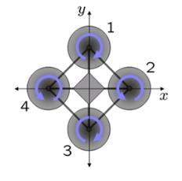
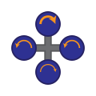
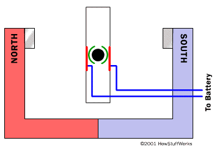
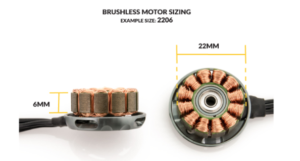
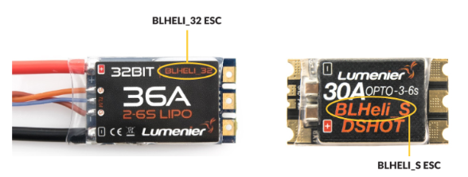
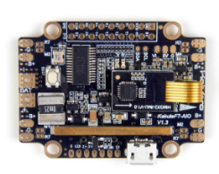
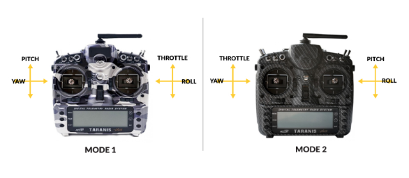
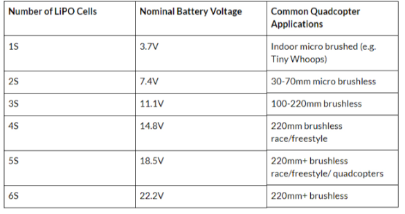

# quadcopter-v1

[Image]

# Introduction

A Quadcopter is a helicopter with four rotors. A rotor is the main rotating part of an electrical machine such as a propeller blade. The rotors provide lift and propulsion for the quadcopter via electromechanical energy conversion. 

There are three dimensions in which a flying object can move through: pitch, yaw, and roll.

<ul>
  <li><strong>Pitch</strong> refers to moving the nose of an aircraft up and down.</li>
  <li><strong>Yaw</strong> refers to moving the nose of an aircraft left and right.</li>
  <li><strong>Roll</strong> refers to tilting (rolling) an aircraft side to side.</li>
</ul>

In order to produce lift and propulsion, a rotor must produce thrust and torque about its (the individual rotors) center of rotation. Gravity as well as a drag force will act upon the quadcopter and will have to be overcome by the rotors in order to propel the machine. 

The above figure shows the direction of rotation of the four rotors. In a quadcopter, pairs of rotors will rotate in opposing directions in order to cancel out any unwanted rotational force. If all four rotors were to spin in one direction, let’s say the clockwise direction, then this would generate a non zero rotational force and would thus cause the quadcopter to spin clockwise about its yaw axis. 

To make a quadcopter hover, its rotors must be spinning at the same angular speed. Two of the rotors will spin clockwise, and the other two will spin counter-clockwise. The forces created by the rotors will cancel each other out and create a hovering effect. 

To adjust the yaw (move aircraft left and right), more thrust would be applied to the rotors rotating in the desired direction.

In order to create a pitch or roll adjustment, more thrust must be applied to a single rotor while simultaneously reducing the amount of thrust sent to the rotor that is diametrically opposite. The quadcopter will dive or tilt in the direction of the rotor that receives less thrust. 

# Mechanical Components

In a quadcopter, the main mechanical component is the frame. The frame is responsible for mounting and connecting all the components together. Frames differ in shapes, dimensions, and materials. A stiff frame is ideal for flight since this reduces warping and bending. The stiff material must not be too brittle since this can cause easier breakages during crashes. The frame must also be light in order to reduce the needed thrust. Heavier frames will need stronger motors. The material should also be able to minimize vibrations as this can damage electrical components. The frame can be broken down into the following: Centre plate, four arms, four motor brackets.

<ul>
  <li>The centre plate is where all of the electrical components are placed.</li>
  <li>The four arms connect to the centre plate (some components can be placed here too).</li>
  <li>The four motor brackets hold the motors on the arms.</li> 
</ul>

Common materials used for frames:

<ul>
<li> Wood - The prominent benefit of using wood is the fact that it is very inexpensive and easy to replace. It will reduce build time. Also fairly rigid. However, it can be aesthetically unappealing </li>
<li> Carbon Fiber - Very tough and extremely lightweight material, this will allow for better flight dynamics and less needed thrust. Expensive option. Best option. </li>
<li> Plastic - Not as ideal since it tends to bend. 3D printing a frame can be useful for small builds. </li>  
</ul>

The size of a frame is usually measured as the longest distance from motor to motor in mm. Frames less than 150 mm are micro frames. 

# Motors

In a DC motor, a spinning armature called the rotor is surrounded by stationary permanent magnets called the stator. The armature (rotor) contains an electromagnet, which creates a magnetic field when electricity is run through it. The generated magnetic field attracts and repels the magnets in the stator causing the armature to spin. In order to keep the armature spinning, the poles of the electromagnet must be changed, which is what the brushes are responsible for. Unfortunately, brushes create a number of inefficiencies such as wear and tear and speed reduction. 

In a brushless DC motor, the permanent magnets are on the rotor and the electromagnets (called poles) are on the stator. A computer is then used to charge up the electromagnets as the shaft turns. The greater the number of poles the more precisely the motor can be controlled. Brushless motors have three wires and depending on their connections, can change the motor spin direction. Quadcopter motors have KV ratings which depicts the RPM per 1 volt applied to the motor. The larger the weight of the quadcopter, the lower the KV rating for the motors. For a lightweight and fast quadcopter, you would use a high KV motor for high rpm. For a heavier quadcopter, you would use a low KV motor for low rpm and more torque. Motor and propeller combinations should be able to generate twice the weight of the craft in thrust. The motor shaft diameter will determine the type and size of propellers.

An identifying feature of a brushless motor is if you see three wires coming out.

The size of a brushless motor is identified by a four-digit code that describes the dimensions of the stator in mm. 

# Propellers

Lightweight and fast quadcopters should have high Kv motors with small propellers. Heavyweight quadcopters should have low Kv motors with large propellers. The higher the Kv rating, the smaller the propeller diameter. 

Smaller propellers allow for quicker flight but reduces efficiency. Large propellers allow for steadier flight, lifts more weight, and uses more power.

Propellers are usually defined by two sizes “500 x 200 mm”, the first size indicates the diameter of the propeller and the second size (called pitch) indicates the linear travel distance in a single rotation.

Higher pitch means a slower rotation which increases speed and uses more power.

Lower pitch propellers can generate more torque and your motors will consume less current.

Propeller size is linked to thrust, responsiveness, and the amount of control the quadcopter will have in the air.

# Electronic Speed Controller Circuits (ESCs)

These are circuits that control a motors speed, direction, and braking. The circuits offer high AC power to the motors.

These are needed for each motor.

ESCs interpret signals and regulate the variation of motor speed.

ESCs regulate the amount of power that goes to the motor. ESC’s apply voltage to a motor. They turn the motor on and off to create a ratio of on and off time. This varies the average voltage induced onto the motor. The switching is controlled by a microprocessor and carried out by transistors called MOSFETs or FETs.

A brushless ESC is used to connect to a brushless motor, they provide superior performance to the brushed ESCs.

ESC’s have three wires that connect to the three wires on the brushless motor. Two other wires connect to the power distribution board. Three smaller wires connect to the flight controller. The ESC should be able to handle the maximum current that your motors use.

Some features:
<ul>
  <li>Brake - Used to force the motor to stop turning once ESC stops delivering power</li>
  <li>Soft Start - Indicates that the control will go from off to full throttle slowly and not instantaneously</li>
  <li>Automatic Cut-off - Power is cut from the motors when battery is low and is reserved for radio signals</li>
</ul>

Most ESC’s are controlled by onboard 32-bit processors running firmware called BLHeli_32 or KISS. 32 bit ESC’s can communicate with faster digital protocols and are capable of things like controlling LEDs, changing motor direction, and telemetry data.

# Flight Controllers

This controls the entire quadcopter.

Communicates with ESC’s via signals to control the motor. 

Usually packed with sensors (accelerometer, gyroscope, barometer). Accelerometer is used to measure linear acceleration. Gyroscopes measure angular acceleration. Barometer measures pressure.

The flight controller receives signals from the onboard radio receiver for remote control.

Controls most of the electronics aboard the quadcopter.

All in one (AIO) flight controllers will also control power distribution and other features. A power distribution board (PDB) allows you to wire battery leads and ESC’s directly onto the flight controller (recommended). Battery eliminator circuit (BEC) can be embedded within flight controllers and are responsible for regulating voltages, they allow 3.3 V, 5 V, and 12 V power sources to be integrated into the board (recommended). BEC’s allow voltage sensitive components such as receivers and cameras to all be powered from the flight controller.

Common microprocessors inside flight controllers include STM32 F1, F3, F4, and F7 chips. The higher the number after the F, the faster the microprocessor and the more functionality it will have. Flight controllers with an F4 or F7 is recommended since they can run the latest FC firmwares. The time it takes to read and respond to sensor inputs i.e the reading and response time is known as the gyro update frequency and PID loop frequency.

Betaflight is the most common firmware used to manage and configure the flight controller.

The flight controller is mounted to the frame with four equally spaced mounting holes.

# PID 

PID stands for Proportional, Integral, Derivative and is the control algorithm responsible for a quadcopter's stability.

Tuning P, I, and D gains will increase the stability and responsiveness of quadcopters. If the quadcopter receives a 45 degree roll input, the quadcopter will roll back and forth around the 45 degree mark until it reaches 45 degrees exactly. PID control loops analyse the gyro and accelerometer data during this process and work to minimize the back and forth rolling until 45 degrees is reached. If the PID loop is well tuned, this process will happen almost instantaneously with minimal back and forth rolling. The P gain controls the responsiveness to stick inputs, a high P gain will result in the quadcopter quickly oscillating back and forth, a low P gain results in slow oscillation. The I gain controls quadcopter positioning during a time interval. I gain’s are useful for automatically resetting a quadcopter to a set angle after a disturbance such as wind. D gains are responsible for how much dampening occurs of the P gain. High D gain results in low visible oscillations. Low D gain means the back and forth oscillations will be visible.

# Radio Transmitters & Receivers

Transmitters and receivers operate each function on the quadcopter via a number of frequency channels.

One channel is needed for throttle, another for yaw movement, another for pitch, another for rolling. A minimum of four channels is needed.

When purchasing a transmitter, you need to determine what mode you prefer:

2.4 GHz is the most popular transmitter frequency for RC, it also has the shortest antenna. A 2.4 GHz transmitter will only work with a 2.4 GHz receiver.

TX protocols are a type of communication between radio transmitter and radio receiver.

RX protocols are between radio receiver and flight controller.

In most cases, in order for a receiver to be compatible with a transmitter it should have the same brand of RX and TX.

Receivers and transmitters must be binded together first in order to work, more information about this should be in an instruction manual.

Receiver antennas are usually soldered directly on the receiver main board. Usually, receivers come with two antennas and they should be kept at 90 degree angles from each other for best signal reception.

# Batteries

Larger batteries allow for longer flight time, but increase the weight of the quadcopter which means more power will be required from the motors.

Lithium batteries are the most common battery used for quadcopters since they have a high energy density and high discharge capability. There are Lithium polymer (LiPo) and Lithium polymer high voltage (LiHV). LiPo cell has a fully charged voltage of 4.2 V. LiHV has a fully charged voltage of 4.35 V. LiPo has a resting voltage of 3.7 V. LiHV has a storage voltage of 3.8 V. LiHV will initially provide more power but abruptly drop in voltage when discharged. LiPo has more linear discharge. LiPo is more commonly used for quadcopters.

A higher drone battery voltage allows the pack to provide more power without increasing the current. The battery pack voltage impacts the maximum motor speed. LiPo packs are commonly sold as 1S, 2S, 3S, 4S, etc where the digit before S stands for number of cells in that specific pack. More cells that are grouped together means more voltage for the battery pack. 4S LiPo’s are commonly used for quadcopters.

Battery capacity is measured in mAh. A higher milliamp hour rating means that it will provide more flight time per charge. A 1300 mAh 4S pack will typically last three minutes of racing flight but depends on how it is flown.

The C-Rating of a battery tells you how much current a battery can supply for a given charge cycle continuously. The higher the C-Rating, the more current the pack can continuously supply. If a battery is forced to supply more current than dictated by its C-Rating for a long time, this can cause excessive damage. High Kv motors require high C-rating batteries. 

Maximum Safe Current Draw (mA) = Battery Capacity (mAh) * C-Rating

This formula can be used to calculate the compatibility between different motors and ESC’s.

Yellow XT60 are common LiPo battery connectors used for 3S-6S batteries.

Use a LiPo bag to prevent fires during storage and charge.

# Power Distribution Board

Responsible for distributing power to the components at the required voltages. 

This is where the battery leads are connected to. 

This part may not be necessary depending on the type of flight controller or ESC that is purchased, which can do these tasks instead.

# Firmware

Betaflight is the most commonly used flight control software and it supports many FC’s out there. It is used mainly for FPV flying and is not the best option for autonomous flight. Will support nearly all FC’s with at least STM32F3. Supports FrSky and also directs ESC’s. Can also control VTX and camera control settings through flight controller. Displays current and battery values directly to FPV feed. Numerous safety features.

Ardupilot is the most popular autopilot firmware. Includes 3D waypoint navigation and a wide range of hardware and software support. 

iNav is used for autonomous drone functions. Supports most FPV flight controllers. Used mainly for people with an FPV drone who want to add autonomous capabilities. Supports Return to Home with a predefined climb height, position hold, waypoints, follow me, and more features. 

# Resources / References

Here are the websites I used to get all of the information for this repo:

Oscar Liang - https://oscarliang.com/

Oscar's website includes very detailed and up to date information on how to build a quadcopter, how to choose parts, and some common tips and tricks. Great resource for any drone enthusiasts and would highly recommend.

https://dronebotworkshop.com/drone-index/

Some explanation on quadcopter dynamics and parts. 

http://dronenodes.com/how-to-build-a-drone/
https://fpvfrenzy.com/build-a-quadcopter/
https://en.wikipedia.org/wiki/Quadcopter
http://andrew.gibiansky.com/blog/physics/quadcopter-dynamics/
https://en.wikipedia.org/wiki/PID_controller

# Online Guides

https://myfirstdrone.com/blog/build-your-first-drone-mounting-the-electronics
https://oscarliang.com/build-racing-drone-fpv-quadcopter/
https://www.getfpv.com/learn/new-to-fpv-beginner/
https://www.youtube.com/watch?v=K05UwsiqZ_E
https://www.youtube.com/watch?v=kQ9FvNB9sNA
https://www.youtube.com/watch?v=TOfY590X4OY
